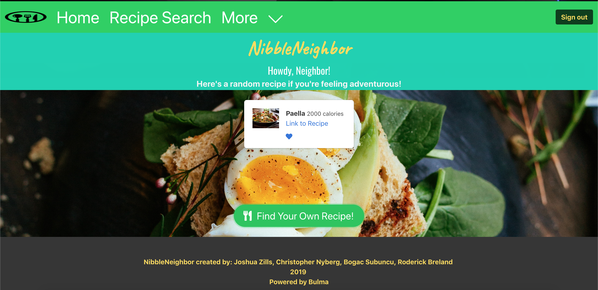

# NibbleNeighbor

### Overview

Nibble Neighbor is a full-stack app that lets the user create an account and then search and save recipes to their profile. The search is done by making an API call to Edamam to get recipes and then the results are displayed to the user on the page. When the user saves a recipe the necessary information is saved to a MySQL database where the information can be retrieved about a specific user when needed.

### Technologies Used

- HTML/CSS
- jQuery
- Node.js
- Express.js
- MySQL

### Future Improvements

- Adding functionality to search with specific ingredients for recipes.
- Adding a social functionality that allows users to create meet ups

### Links

- [Application](https://nibbleneighbor.herokuapp.com/)

### Meet the Team

- [Bogac Sabuncu](https://github.com/BogacSabuncu): Project Manager/Back-End/Front-End
- [Joshua Zills](https://github.com/DoubleMercury): Front-End
- [Chris Nyberg](https://github.com/crnyberg91): Back-End/Front-End
- [Rod](https://github.com/darylbre): Front-End

